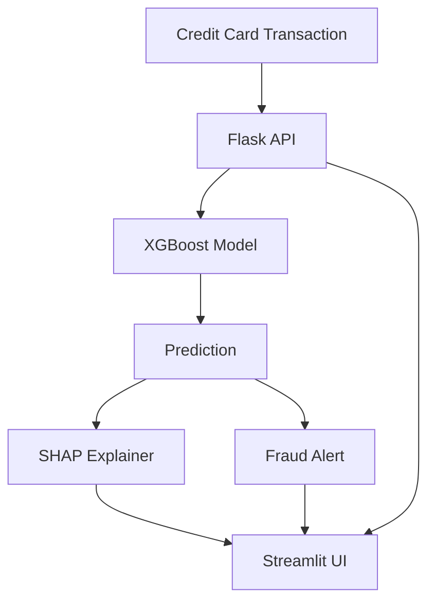

# Credit Card Fraud Detection System

A comprehensive system for detecting fraudulent credit card transactions using machine learning, featuring real-time prediction capabilities and an interactive user interface.

## 🚀 Project Overview

This project implements an end-to-end credit card fraud detection system with the following components:

1. **Advanced Fraud Detection Model** (`fraud_detection.py`)
   - Implements sophisticated ML pipeline with XGBoost and LightGBM
   - Features automatic hyperparameter tuning
   - Includes advanced resampling techniques for imbalanced data
   - Provides model interpretability using SHAP values

2. **Real-time Prediction API** (`app.py`)
   - Flask-based REST API for real-time fraud predictions
   - Visual fraud alerts using OpenCV
   - SHAP value generation for model explainability
   - Robust input validation and error handling

3. **Interactive User Interface** (`app_ui.py`)
   - Streamlit-based web interface
   - Real-time transaction analysis
   - Visual explanations of model decisions
   - Key insights from SHAP values

4. **Model Training Script** (`train_model.py`)
   - Simplified training pipeline
   - Dataset splitting and model evaluation
   - Model persistence functionality

## 🛠️ Technical Architecture



## 🔧 Setup and Installation

1. **Clone the repository**
2. **Install dependencies:**
   ```bash
   pip install flask streamlit xgboost lightgbm shap opencv-python pandas numpy scikit-learn
   ```
3. **Run the components:**
   - Start API server:
     ```bash
     python app.py
     ```
   - Launch UI:
     ```bash
     streamlit run app_ui.py
     ```

## 📊 Data Requirements

The system expects a CSV file (`creditcard.csv`) with the following:
- 30 numerical input features (V1-V30)
- Target variable 'Class' (0 for normal, 1 for fraud)
- Optional 'Time' and 'Amount' features

## 🚀 API Endpoints

### Prediction Endpoint
- **URL:** `/predict`
- **Method:** POST
- **Input:**
  ```json
  {
    "features": [float_array_of_30_values]
  }
  ```
- **Response:**
  ```json
  {
    "fraud_probability": float,
    "prediction": "Fraud" | "Normal",
    "shap_values": array
  }
  ```

## 💻 User Interface Features

1. **Transaction Input**
   - Input fields for 30 transaction features
   - Real-time validation

2. **Prediction Display**
   - Fraud probability metric
   - Clear prediction labels
   - Visual fraud alerts

3. **Explainability Features**
   - SHAP value visualization
   - Feature importance plots
   - Key insight summaries

## 🔍 Model Details

### Training Pipeline (`fraud_detection.py`)

1. **Data Loading & Exploration**
   ```python
   load_and_explore_data(filepath)
   ```
   - Loads dataset
   - Generates distribution plots
   - Analyzes class imbalance

2. **Preprocessing**
   ```python
   preprocess_data(df, anomaly_report)
   ```
   - Feature scaling
   - Anomaly detection
   - Feature engineering

3. **Model Training**
   ```python
   train_model(X_train, y_train, X_val, y_val)
   ```
   - Multiple model training (XGBoost, LightGBM)
   - Hyperparameter optimization
   - Model ensemble creation

4. **Evaluation**
   ```python
   evaluate_model(model, X_test, y_test)
   ```
   - Comprehensive metrics
   - ROC and PR curves
   - Confusion matrix

### Advanced Features

1. **Threshold Optimization**
   ```python
   optimize_threshold(y_test, y_pred_proba)
   ```
   - Cost-sensitive analysis
   - F1 and F2 score optimization
   - Business-oriented thresholding

2. **Model Interpretability**
   - SHAP value generation
   - Feature importance analysis
   - Interactive visualizations

## 📈 Performance Metrics

The system evaluates models using:
- Accuracy
- Precision
- Recall
- F1 Score
- ROC-AUC
- PR-AUC

## 🔒 Security Considerations

1. **Input Validation**
   - Feature count verification
   - Data type checking
   - Value range validation

2. **API Security**
   - Error handling
   - Rate limiting (recommended)
   - Input sanitization

## 🔄 Development Workflow

1. **Model Training:**
   ```bash
   python train_model.py
   ```

2. **API Development:**
   - Modify `app.py` for API changes
   - Test endpoints using Postman/curl

3. **UI Updates:**
   - Modify `app_ui.py` for interface changes
   - Test with sample transactions

## 🤝 Contributing

1. Fork the repository
2. Create a feature branch
3. Make your changes
4. Submit a pull request

## 📝 License

[Add your license information here]

## 🙏 Acknowledgments

- Libraries: Flask, Streamlit, XGBoost, LightGBM, SHAP
- Contributors and maintainers
