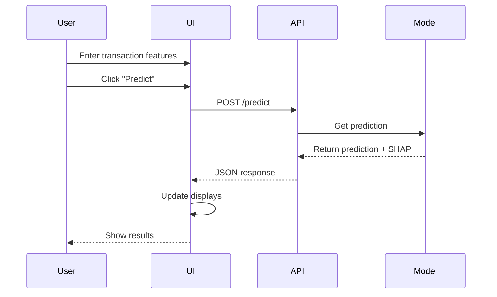

# Credit Card Fraud Detection UI Documentation

## Overview

The Streamlit-based user interface provides an interactive way to analyze credit card transactions for potential fraud. It connects to the Flask API backend and presents predictions with detailed explanations.

## Components

### 1. Page Configuration
```python
st.set_page_config(
    page_title="Credit Card Fraud Detection",
    layout="wide"
)
```

### 2. Feature Input
- Location: Sidebar
- 30 numeric input fields
- Real-time validation
- Default values set to 0.0

### 3. Main Display Areas
1. Prediction Results
   - Fraud probability metric
   - Prediction label (Fraud/Normal)
   - Alert notifications

2. SHAP Explanations
   - Feature importance visualization
   - Key insights summary
   - Individual feature impacts

3. API Response Debug Area
   - Raw API response
   - Error messages
   - Connection status

## User Interface Flow



## Feature Sections

### 1. Transaction Input
```python
features = [
    st.sidebar.number_input(f"Feature {i+1}", value=0.0)
    for i in range(30)
]
```

### 2. Prediction Display
```python
st.metric(
    label="Fraud Probability",
    value=f"{fraud_probability:.6f}"
)

st.metric(
    label="Prediction",
    value=prediction_label
)
```

### 3. Alert System
```python
if prediction_label == "⚠️ Fraud":
    st.error("🚨 **Fraud Detected!**")
else:
    st.success("✅ Normal Transaction")
```

### 4. SHAP Visualization
```python
st.markdown("### 🔎 SHAP Explainability")
fig, ax = plt.subplots(figsize=(10, 5))
shap.bar_plot(shap_values, feature_names, show=False)
st.pyplot(fig)
```

### 5. Key Insights
```python
st.markdown("### 📝 Key Insights from SHAP")
for feature, impact in sorted_features:
    direction = "Decreased" if impact < 0 else "Increased"
    st.markdown(f"- **{feature}** {direction} fraud likelihood")
```

## API Integration

### 1. Connection Setup
```python
api_url = "http://127.0.0.1:5000/predict"
```

### 2. Request Formation
```python
response = requests.post(
    api_url,
    json={"features": features}
)
```

### 3. Response Handling
```python
if response.status_code == 200:
    data = response.json()
    # Process and display results
else:
    st.error("API request failed")
```

## Error Handling

### 1. API Connection Errors
- Connection timeout handling
- Server error responses
- Invalid response formats

### 2. Input Validation
- Feature count verification
- Numeric value validation
- Range checking

### 3. Display Errors
- Clear error messages
- User-friendly notifications
- Recovery suggestions

## Performance Optimizations

### 1. Data Loading
- Lazy loading of visualizations
- Cached API responses
- Optimized SHAP calculations

### 2. UI Responsiveness
- Async API calls
- Progressive loading
- Optimized redraws

### 3. Memory Management
- Efficient data structures
- Garbage collection
- Resource cleanup

## Customization Options

### 1. Theme Configuration
- Page layout options
- Color schemes
- Font selections

### 2. Display Settings
- Chart dimensions
- Data precision
- Alert durations

### 3. Feature Labels
- Custom feature names
- Description tooltips
- Unit specifications

## Development Guidelines

### 1. Code Organization
```
app_ui.py
├── UI Configuration
├── Sidebar Components
├── Main Display Logic
├── API Integration
└── Visualization Functions
```

### 2. Style Guide
- Follow PEP 8
- Use descriptive variable names
- Include docstrings
- Comment complex logic

### 3. Testing
- Unit tests for components
- Integration tests with API
- UI automation tests

## Future Enhancements

### 1. UI Improvements
- Dark mode support
- Mobile responsiveness
- Keyboard shortcuts
- Batch prediction support

### 2. Visualization Enhancements
- Interactive SHAP plots
- Time series analysis
- Comparative visualizations
- 3D feature space plotting

### 3. User Experience
- Guided tutorials
- Preset examples
- Save/load feature sets
- Export results

### 4. Advanced Features
- Real-time monitoring
- Custom thresholds
- Feature importance filters
- Prediction history

## Best Practices

### 1. User Interface
- Clear visual hierarchy
- Consistent layout
- Immediate feedback
- Intuitive controls

### 2. Error Prevention
- Input validation
- Confirmation dialogs
- Clear error messages
- Recovery options

### 3. Performance
- Minimize API calls
- Optimize rendering
- Cache results
- Clean up resources

### 4. Security
- Input sanitization
- Secure API calls
- Data validation
- Error masking
